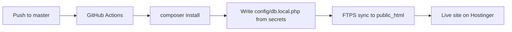

# Deploy EVSU RFID Library to Hostinger (CI/CD)

This project deploys automatically to Hostinger when you push to the **`master`** branch on GitHub, using [GitHub Actions](.github/workflows/deploy-hostinger.yml) and **FTPS**.

Repository: `https://github.com/AutesJesus/EVSU_RFID_LibraryManagementSystem`

---

## 1. Hostinger setup (one time)

### 1.1 Add your site

1. Log in to [Hostinger hPanel](https://hpanel.hostinger.com).
2. Create or select your hosting plan and **add your domain** (or use the free `*.hostingersite.com` subdomain for testing).
3. Note your site’s **document root** — usually `public_html` at:
   - `/home/<username>/domains/<your-domain>/public_html/`

### 1.2 PHP version

1. hPanel → **Advanced** → **PHP Configuration** (or **Select PHP Version**).
2. Choose **PHP 8.1 or 8.2** (matches the workflow).
3. Enable extensions: `pdo_mysql`, `mbstring`, `openssl`, `json`.

### 1.3 MySQL database

1. hPanel → **Databases** → **MySQL Databases**.
2. Create a database (e.g. `u123456789_evsu_rfid`).
3. Create a user with a strong password and **assign all privileges** to that database.
4. Save these four values for GitHub secrets:
   - **Host** — often `localhost` on shared hosting (hPanel shows the exact hostname).
   - **Database name**
   - **Username**
   - **Password**

Import data from local XAMPP if needed (phpMyAdmin → Export locally → Import on Hostinger).

### 1.4 FTP account (for deployment)

1. hPanel → **Files** → **FTP Accounts**.
2. Create an FTP user (or use the main account).
3. Set the **directory** to your site’s `public_html` folder.
4. Note:
   - **FTP hostname** (e.g. `ftp.yourdomain.com` or the host shown in hPanel)
   - **Username**
   - **Password**
   - **Port** — usually `21` with **FTPS**

---

## 2. GitHub secrets and variables

In your repo: **Settings → Secrets and variables → Actions**.

### Secrets (required)

| Secret | Example | Description |
|--------|---------|-------------|
| `FTP_SERVER` | `ftp.yourdomain.com` | FTPS hostname from hPanel |
| `FTP_USERNAME` | `u123456789` | FTP username |
| `FTP_PASSWORD` | `••••••••` | FTP password |
| `FTP_PORT` | `21` | Optional; omit in workflow defaults to 21 |
| `DB_HOST` | `localhost` | MySQL host from hPanel |
| `DB_USER` | `u123456789_app` | MySQL user |
| `DB_PASS` | `••••••••` | MySQL password |
| `DB_NAME` | `u123456789_evsu_rfid` | MySQL database name |

### Variables (optional)

**Settings → Secrets and variables → Actions → Variables**

| Variable | Default | Description |
|----------|---------|-------------|
| `FTP_SERVER_DIR` | `./public_html/` | Remote folder for FTP deploy. Use `./` if FTP user root is already `public_html`. |

### Optional: GitHub Environment

The workflow uses environment **`production`**. You can create it under **Settings → Environments** and require approval before deploy — useful for teams.

---

## 3. First deploy

1. Commit and push the workflow and config files to **`master`**.
2. Open **Actions** on GitHub → **Deploy to Hostinger** → confirm the run is green.
3. Visit your domain (e.g. `https://yourdomain.com/` or `https://yoursite.hostingersite.com/`).

### After deploy (manual once)

1. **Mail** — On the server, create `config/mail.local.php` from `config/mail.local.php.example` (File Manager or FTP), or add Brevo secrets later via a separate deploy step.
2. **Uploads** — The workflow does **not** overwrite `uploads/` (user files stay). Ensure `uploads/` is writable (chmod `755` or `775`).
3. **Admin** — First visit runs schema migrations via `get_pdo()`. Log in with default admin if the DB is empty (change password immediately).

---

## 4. How CI/CD works



- **Trigger:** push to `master` or **Run workflow** (manual).
- **Build:** `composer install --no-dev` on the runner (so `vendor/` is deployed; Hostinger does not need Composer on the server).
- **Config:** `scripts/ci-write-config.php` writes `config/db.local.php` during the job (not stored in git).
- **Deploy:** [SamKirkland/FTP-Deploy-Action](https://github.com/SamKirkland/FTP-Deploy-Action) syncs only changed files.

---

## 5. Local development

Copy examples (not committed):

```text
config/db.local.php   ← from config/db.local.php.example
config/mail.local.php ← from config/mail.local.php.example
```

`db.php` loads `config/database.php`, which applies `db.local.php` overrides.

---

## 6. Troubleshooting

| Issue | What to check |
|-------|----------------|
| FTP login failed | Host, user, password, port; try FTPS in FileZilla first |
| 500 error / blank page | PHP version, `pdo_mysql`, hPanel error logs |
| Database connection error | `DB_*` secrets match hPanel; `DB_HOST` is often `localhost` |
| CSS/JS broken | Site must be served from the folder where `index.php` was deployed (`FTP_SERVER_DIR`) |
| Permission denied on uploads | `uploads/` permissions on server |
| Workflow skips DB config | `DB_HOST` secret missing — add it and re-run |

### Manual deploy (fallback)

Use FileZilla with **FTPS**, upload the project into `public_html`, run `composer install` locally first and upload `vendor/`, and create `config/db.local.php` on the server.

---

## 7. Security checklist

- [ ] Change default admin password after first login
- [ ] Use strong MySQL and FTP passwords
- [ ] Do not commit `config/db.local.php` or `config/mail.local.php`
- [ ] Restrict GitHub secrets to collaborators who need deploy access
- [ ] Enable SSL in hPanel (Let’s Encrypt) for HTTPS
